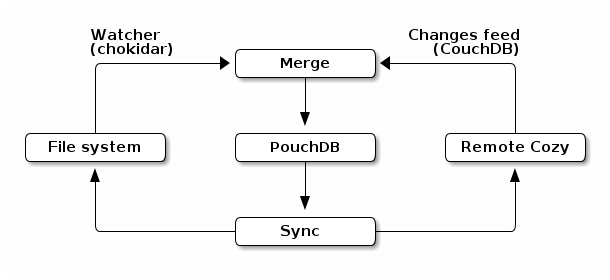

Cozy-Desktop - Design
=====================

The Cozy desktop app allows to sync the files stored in your Cozy with your laptop
and/or your desktop. It replicates your files on your hard drive and apply
changes you made on them on other synced devices and on your online Cozy.

Metadata workflow
-----------------

Cozy-desktop is a nodejs app, written in coffeescript to be coherent with
other cozy codes. As its core, there is a pouchdb database used to keep
metadata about files and folders.

On the remote cozy, the files and folders are saved in CouchDB. Cozy-desktop
listens to the changes feed of CouchDB to be notified of all the metadata
changes on the remote cozy. Those metadata are recopied in the local PouchDB.

On the local filesystem, the synchronized folder is watched via chokidar. It's
a library that uses nodejs' watch powered by inotify/fsevents (with a fallback
on polling). With it, cozy-desktop is notified of all the changes on the file
system and can update the pouchdb with the new metadata.

Cozy-desktop also uses a changes feed on the local PouchDB. It takes metadata
changes one by one, and apply them to the other side. For example, if the last
modification date of a folder has changed on the remote cozy, cozy-desktop
will update it on the local filesystem.

If a new file is added, cozy-desktop will ask one side to provide a nodejs
readable stream, and the other side will pipe it to its destination: a file on
the local filesytem, or a binary document on the remote couchdb.

Conflicts
---------

Conflicts can happen. For example, when cozy-desktop is stopped, a file is
added on the remote cozy and a different file is added to the local filesystem
at the same path. When cozy-desktop will start, it will detect that both the
remote cozy instance and the local filesystem have a file for the same path.

The conflict resolution is very simple: one of those file is renamed with a
`-conflict` suffix. A more evolved solution would have been very hard to
secure. And bugs in this part mean losing data, which is very bad. So, we
don't try to be smart and prefer a robust solution.

Documents schema
----------------

See [`backend/merge.coffee`](https://github.com/cozy-labs/cozy-desktop/blob/master/backend/merge.coffee#L15-L37)
